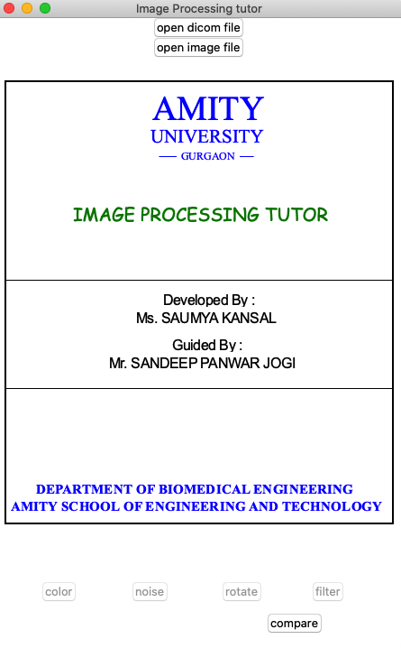

# Image-Processing-Tutor
A standalone windows only application.

Copy the file and save it.

## Implementations

1. Open command prompt
2. pip install pyinstaller
3. pyinstaller --onefile FILENAME. (in this case IPT.py)
4. Your .exe file will be in dist folder

You can share it to anyone irrespective of whether that person have Python in their system or not

## Firstlook

